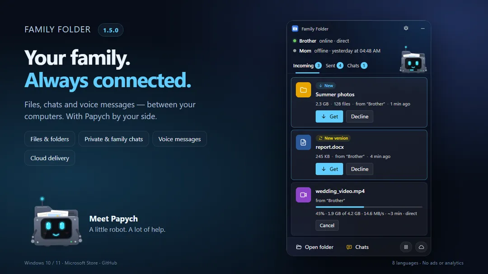
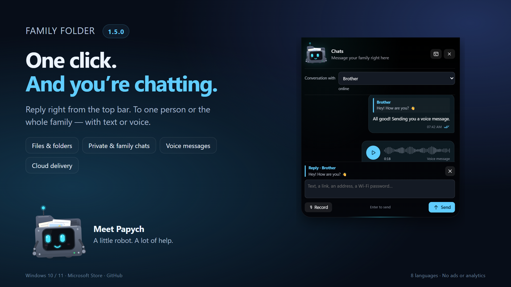
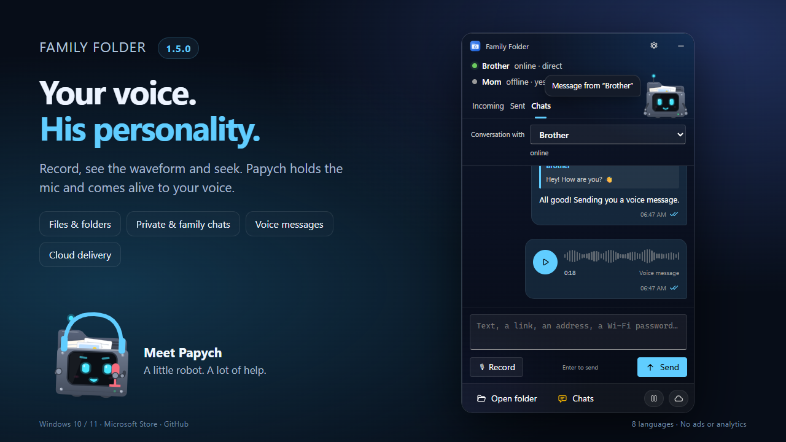
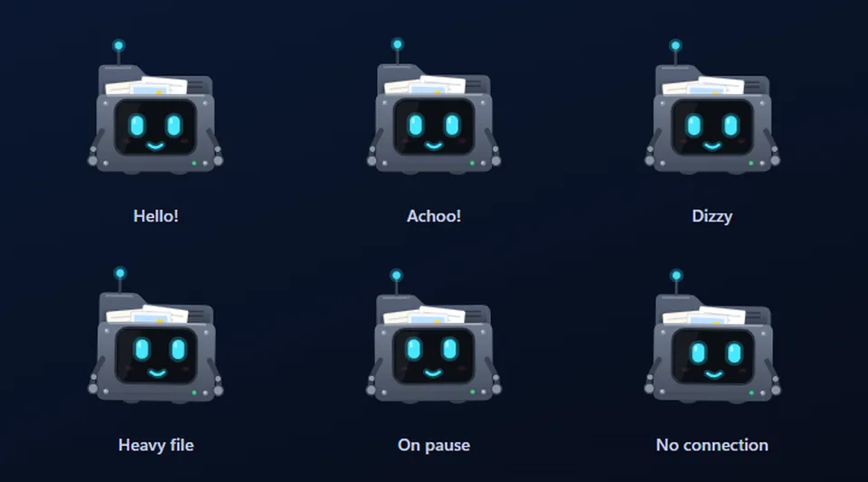
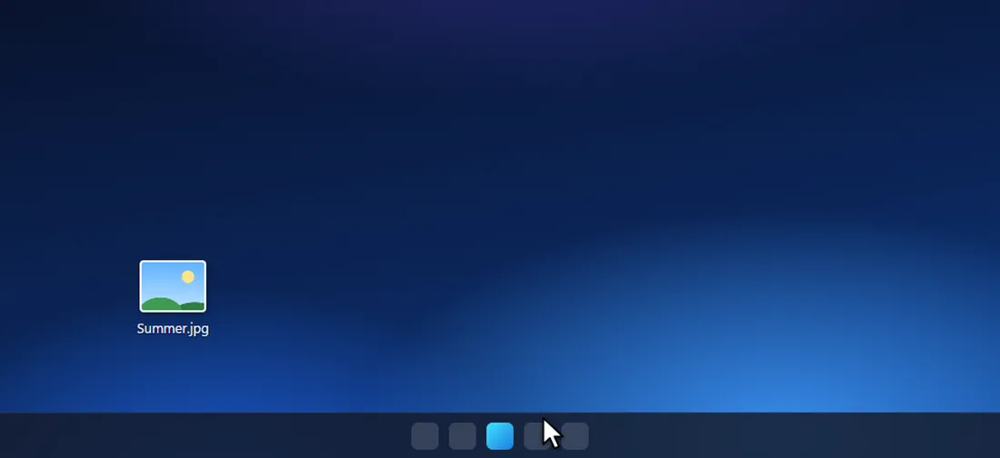
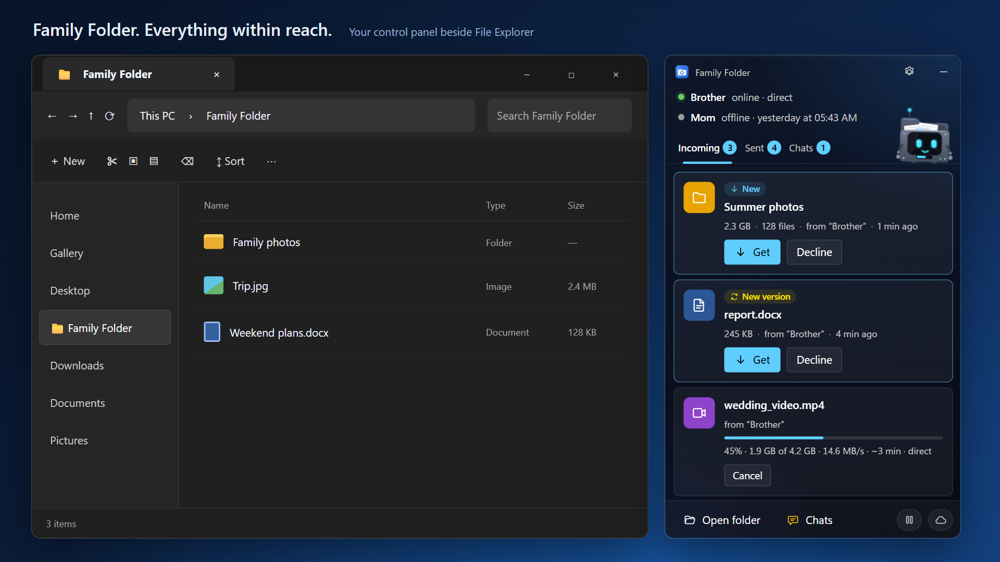
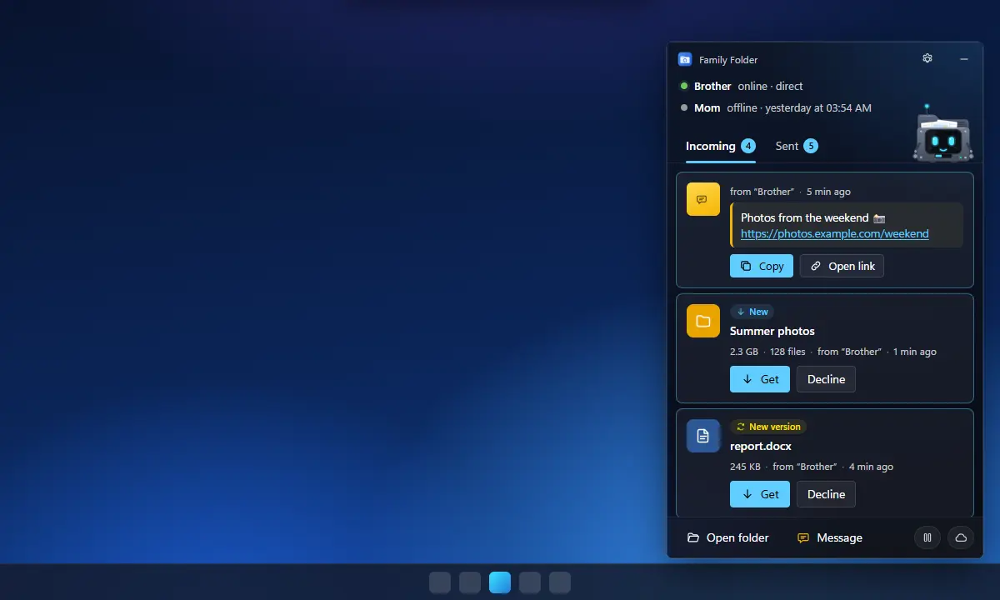
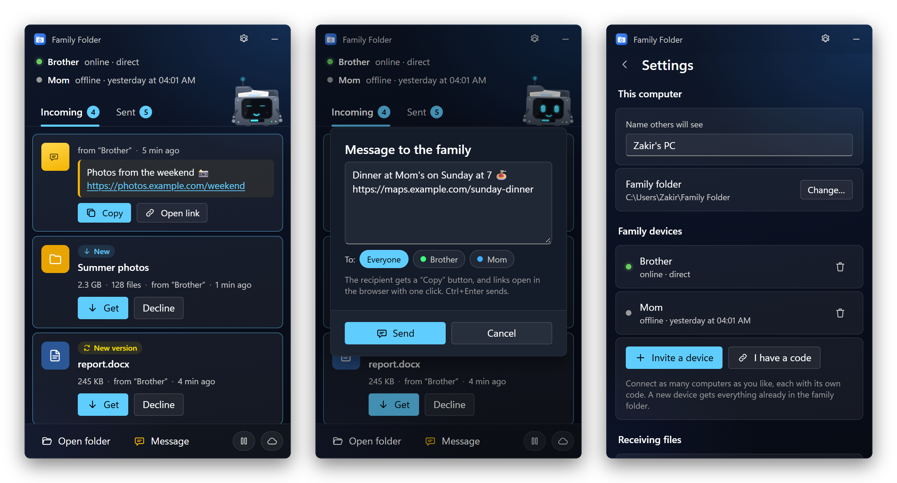
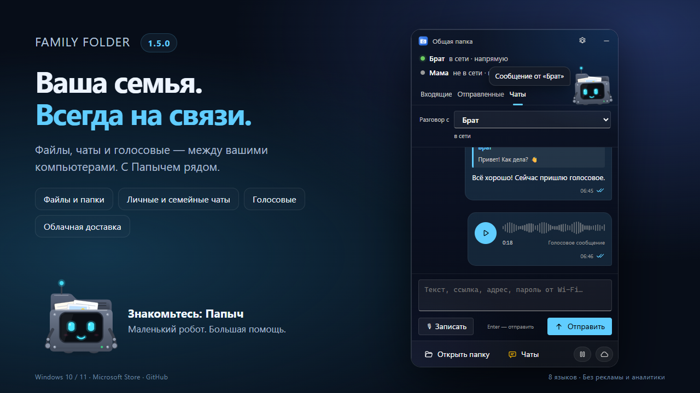

<div align="center">


# Family Folder

**Files, chats and voice messages for your family,<br>directly between your computers — with Papych by your side.**

Put a photo in the folder and it pops up on your brother's PC a moment later.<br>
Carrying it there is **Papych** — a little robot folder with a big personality.

<a href="https://apps.microsoft.com/detail/9NX8CF7SNKBF"></a>
&nbsp;&nbsp;
<a href="https://github.com/ZakitKH0000/FamilyFolder/releases/download/v1.5.0/FamilyFolder-1.5.0-Setup.exe"></a>

<sub>Windows 10 / 11 · 64-bit · free · 8 languages · <a href="https://github.com/ZakitKH0000/FamilyFolder/releases">all versions</a></sub>

<br>



**English** · [Русский](#русский)

</div>

---

## ✨ What it does

- **It's just a folder.** Drop files into *Family Folder* (it's pinned in Explorer). Your family gets **Get / Decline** — and the file comes **directly from your computer**.
- **Any size.** A photo, a 50 GB video, a whole game folder. Transfers resume after sleep or a dropped connection, and every byte is verified.
- **Works anywhere.** Different cities, home Wi-Fi, a phone hotspot — computers find each other on their own and connect directly whenever possible, otherwise through an encrypted relay.
- **Private and family chats.** Text, links, replies and voice messages, with conversation history and delivery status. Hover over a message to copy or reply.
- **Both ways, safely.** Everyone can send and receive. Deleting a file never deletes it on other computers. A changed file arrives as a new version; if two people edit at once, both versions are kept; replaced files go to the Recycle Bin.

## 💬 A real chat, right where you need it

<div align="center"></div>

Choose a relative or the whole family in **Chats**, or click **Reply** in a notification: the top bar expands into a mini chat. Record a voice message, see its waveform and seek during playback. Papych jumps from his place above the tabs to the microphone and playback button. Notification sounds have their own volume control and mute switch.

<div align="center"></div>

If your relative is offline, connect your own **Yandex Disk, WebDAV or cloud folder**. Text and voice messages wait in an encrypted mailbox; after the app confirms **In the cloud**, you can turn off your computer. The recipient gets them on their next launch with the same cloud connected. All participants need **1.5.0 or newer**. Cloud copies are cleaned up after acknowledgement when the sender returns online.

## 🤖 Meet Papych

<div align="center"></div>

Papych lives in the app window and in the bar at the top of your screen — and he takes his job very seriously.

- His **eyes follow your cursor** across the whole screen. He breathes, blinks, gets bored, yawns — and falls asleep if you leave him alone for too long.
- Drop files on him and he **swallows them** and sends them off as a **paper plane** in the recipient's color.
- When something arrives, he **spits it out** right into the list, **jumps up and presses “Get”** for you, and cheers when the download is done. The overall progress runs across his belly.
- He **sneezes**, gets **dizzy** if you poke him too much, wears a **nightcap** while transfers are paused, looks around for the signal when you're offline and strains under really heavy files.
- He shares **tips** in a speech bubble — you can turn them off in Settings.

## 🎚️ The bar at the top of the screen

<div align="center"></div>

- **Drag files to the top of the screen** and a sleek black bar slides down with Papych and a mini robot for every family member. Drop on Papych — **everyone** gets it. Drop on a mini robot — **only that person** does.
- **Nudge the pointer to the top center** and the bar peeks out: who's online and how the downloads are going.
- New files show up right there with **Get / Decline**, along with “received”, “delivered” and “new device joined”.
- Prefer classic notifications? Choose the bar, Windows notifications, or both. During full-screen games and movies it stays out of the way and uses a quiet Windows notification.

## 📁 A control panel beside File Explorer

<div align="center"></div>

Open your shared folder in File Explorer and an optional panel appears beside it. Receive files, watch transfers, open chats and pause sharing without switching away from your folder. Enable it in Settings. The illustration uses demonstration files.

## 🗺️ A guided tour by Papych

<div align="center"></div>

After you install or update the app, Papych **jumps out of the window** and walks you through everything with his **pointer stick**: the bar, dragging files, the window, messages and the pause button by the clock. Replay it anytime in **Settings → Papych**.

## 🪟 The app

<div align="center"></div>

- **A family of any size.** Connect computers with a one-time invite code (valid for 24 hours).
- **Auto-accept**: always ask, photos only, or all files — with a size limit; programs are always asked about separately, and 5 GB of disk space is always kept free.
- **Pause** for 30 minutes, 1 hour, 3 hours or until you resume.
- **Optional cloud route** for when your computers aren't online at the same time: Yandex Disk, WebDAV (Nextcloud, Koofr, pCloud, NAS…) or a OneDrive / Google Drive / Dropbox folder. Files are encrypted before upload and deleted after delivery.
- **Updates itself within the family.** Once one computer has a new version, the others get the signed installer from it and update quietly when nothing is being transferred.
- **Feels at home in Windows:** pinned in Explorer, a desktop shortcut, an optional side panel next to the folder and an icon by the clock. Live Mica background on Windows 11.
- **8 languages**, following your Windows language: English, Русский, Deutsch, Español, Français, Português, Türkçe, 中文.

## 🔒 Privacy

- No accounts, no ads, no analytics, no servers of its own.
- Files travel directly between your computers over an encrypted connection (QUIC, TLS 1.3). To find each other, computers use the public servers of the iroh project — they see device keys and IP addresses, never the contents of your files.
- The cloud is used only if you connect one, with your own account.
- Settings and keys never leave your computer.

## ⬇️ Install

**New in [1.5.0](https://github.com/ZakitKH0000/FamilyFolder/releases/tag/v1.5.0):** private and family chats, voice messages, quick replies in the top bar, new Papych animations, notification sounds and encrypted cloud delivery of messages. The interface now supports eight languages. The 1.5.0 Microsoft Store package is prepared; this update is not yet submitted or published there.

**Recommended: [Microsoft Store](https://apps.microsoft.com/detail/9NX8CF7SNKBF).** One click to install, updates arrive automatically, and Windows shows no warnings.

Or use the installer: download **[FamilyFolder-1.5.0-Setup.exe](https://github.com/ZakitKH0000/FamilyFolder/releases/download/v1.5.0/FamilyFolder-1.5.0-Setup.exe)** (Windows 10 / 11, 64-bit, 7 MB) and run it. Windows may say *“Windows protected your PC”* — the installer isn't signed with a paid certificate yet; click **More info → Run anyway**. Installed this way, the app updates itself from your family.

Pick one of the two — there's no need for both on the same computer.

Then, on the first computer, open **Settings → Invite a device** and send the code to your relative. On their computer, choose **I have a code**. That's it!

## 💬 From the author

> This is my **first public project**. 🎉
>
> I made Family Folder for my own family — so we could share photos, videos and documents between our computers without clouds, accounts or USB sticks. Papych showed up along the way and quickly became the heart of the app.
>
> If you like it, please **star ⭐ the repository** and tell your friends. Found a bug or have an idea? Open an [Issue](https://github.com/ZakitKH0000/FamilyFolder/issues) — I'll be glad to read it.
>
> Thank you for trying it!
> — **Zakir**

## 🛠️ Source code

The code is open for reading — see how everything works, Papych included (`crates/app/ui/papych.js`).

- `crates/core` — the sync engine (no UI): connections, transfers, family, cloud.
- `crates/app` — the Windows app (Tauri): the window, the bar at the top, the tour and Papych in plain HTML/CSS/JS (`crates/app/ui`).
- `crates/core/locales` — translations, `design/` — Papych's design lab and the scenes for these animations.

Build: Windows 10/11, Rust (stable, MSVC) and Node.js.

```powershell
npm install
cargo test -p obshaya-core                     # engine tests (needs internet, ~2 min)
cd crates\app; npx --prefix ..\.. tauri build  # installer → target\release\bundle\nsis
```

## 📄 License

Free to download and use. © 2026 Zakir. All rights reserved: the source code is published for reading and personal study, but the app, its code and the Papych character may not be copied into other projects or redistributed, modified or not, without permission. See [LICENSE](LICENSE). Open-source components used in the app: [THIRD_PARTY.md](THIRD_PARTY.md).

---

<div align="center">

# Русский

</div>

## «Общая папка»

**Файлы, чаты и голосовые для всей семьи — между вашими компьютерами, с Папычем рядом.**
Положили фото в папку — и через мгновение оно уже на компьютере брата. А доставляет его **Папыч** — маленький робот-папка с большим характером.

**[⬇️ Установить из Microsoft Store](https://apps.microsoft.com/detail/9NX8CF7SNKBF)** · [установщик 1.5.0](https://github.com/ZakitKH0000/FamilyFolder/releases/download/v1.5.0/FamilyFolder-1.5.0-Setup.exe) · Windows 10 / 11 · бесплатно · 8 языков

### ✨ Что умеет

- **Это просто папка.** Положите файлы в «Общую папку» (она закреплена в Проводнике). У родных появится **«Получить / Отклонить»** — и файл придёт **напрямую с вашего компьютера**.
- **Любой размер.** Фото, видео на 50 ГБ, целая папка с игрой. После сна или обрыва связи передача продолжится, каждый байт проверяется.
- **Работает где угодно.** Разные города, домашний Wi-Fi, раздача с телефона — компьютеры сами находят друг друга и соединяются напрямую, а если не выходит — через зашифрованный ретранслятор.
- **Личные и семейные чаты.** Тексты, ссылки, ответы и голосовые, история переписки и статус доставки. Наведите курсор на сообщение, чтобы скопировать его или ответить.
- **В обе стороны и бережно.** Отправлять и получать могут все. Удаление файла у других ничего не удаляет. Изменённый файл приходит новой версией; если двое правили одновременно — сохраняются обе; заменённые файлы уходят в Корзину.

### 💬 Чат прямо в шторке

<div align="center"></div>

Откройте **Чаты**, выберите человека или всю семью. Можно ответить прямо из уведомления: шторка удлинится и покажет мини-чат. У голосового сообщения есть волна звука и перемотка, а Папыч прыгает со своего места сверху к микрофону и кнопке воспроизведения. Звук уведомлений можно прослушать, выключить или изменить его громкость.

Если адресат не в сети, подключите **Яндекс Диск, WebDAV или облачную папку**. Текст и голос будут ждать в зашифрованной очереди. После подтверждения **«В облаке»** можно выключить компьютер: адресат получит сообщения при следующем запуске с подключённым тем же облаком. Всем участникам нужна версия **1.5.0 или новее**. Очистка облачных копий после подтверждения доставки происходит, когда отправитель снова запускает приложение.

### 🤖 Знакомьтесь: Папыч

Папыч живёт в окне программы и в шторке сверху экрана — и относится к своей работе очень серьёзно.

- **Глазами следит за курсором** по всему экрану. Дышит, моргает, скучает, зевает — и засыпает, если долго его не трогать.
- Бросьте на него файлы — он их **проглотит** и отправит **бумажным самолётиком** цвета получателя.
- Когда что-то пришло — **выплюнет** файл прямо в список, **подпрыгнет и сам нажмёт «Получить»**, а скачанному обрадуется. На животике — общий ход загрузок.
- **Чихает**, **кружится**, если затыкать, на паузе спит в **ночном колпаке**, без связи озирается в поисках сигнала, а под очень тяжёлыми файлами пыхтит.
- Даёт **подсказки** в облачке — их можно выключить в настройках.

### 🎚️ Шторка сверху экрана

- **Потащите файлы к верху экрана** — выедет чёрная шторка с Папычем и мини-роботами всех родных. Бросите на Папыча — получат **все**, на мини-робота — **только он**.
- **Подведите курсор к верху по центру** — шторка выглянет: кто в сети и как идут загрузки.
- Новые файлы появляются прямо в ней с кнопками **«Получить / Отклонить»**, а ещё «получено», «доставлено» и «подключено новое устройство».
- Привыкли к обычным уведомлениям? Выберите шторку, уведомления Windows или и то и другое. Во время игр и фильмов на весь экран шторка не мешает — придёт тихое уведомление Windows.

### 📁 Панель рядом с Проводником

Откройте общую папку в Проводнике — рядом появится панель приложения. Принимайте файлы, следите за передачей, открывайте чаты и ставьте обмен на паузу прямо возле папки. Панель можно включить в настройках.

### 🗺️ Экскурсия с Папычем

После установки или обновления Папыч **выпрыгивает из окна** и с **указкой** показывает всё: шторку, перетаскивание файлов, окно, сообщения и паузу у часов. Повторить можно в любой момент: **Настройки → Папыч**.

### 🪟 Программа

- **Семья любого размера.** Компьютеры подключаются по одноразовому коду приглашения (действует 24 часа).
- **Автоприём:** всегда спрашивать, только фото или все файлы — с пределом размера; о программах всегда спросит отдельно, а 5 ГБ на диске всегда оставит свободными.
- **Пауза** на 30 минут, 1 час, 3 часа или пока не продолжите.
- **Облако по желанию** — на случай, когда компьютеры не включены одновременно: Яндекс Диск, WebDAV (Nextcloud, Koofr, pCloud, NAS…) или папка OneDrive / Google Диска / Dropbox. Файлы шифруются перед загрузкой и удаляются после доставки.
- **Обновляется сама внутри семьи.** Как только у одного компьютера новая версия, остальные получают от него подписанный установщик и тихо обновляются, когда ничего не передаётся.
- **Как родная в Windows:** закреплена в Проводнике, ярлык на рабочем столе, панель рядом с папкой и значок у часов. На Windows 11 — живой фон Mica.
- **8 языков** — по языку Windows.

### 🔒 Конфиденциальность

- Без учётных записей, рекламы, статистики и своих серверов.
- Файлы идут напрямую между вашими компьютерами по зашифрованному соединению (QUIC, TLS 1.3). Чтобы найти друг друга, компьютеры используют общедоступные серверы проекта iroh — они видят ключи устройств и IP-адреса, но не содержимое файлов.
- Облако используется, только если вы его подключите, — с вашей учётной записью.
- Настройки и ключи не покидают ваш компьютер.

### ⬇️ Установка

**Новое в [1.5.0](https://github.com/ZakitKH0000/FamilyFolder/releases/tag/v1.5.0):** личные и семейные чаты, голосовые сообщения, быстрые ответы в шторке, новые анимации Папыча, звук уведомлений и зашифрованная облачная доставка сообщений. В интерфейсе восемь языков. Пакет 1.5.0 для Microsoft Store подготовлен, но обновление туда ещё не отправлено и не опубликовано.

**Лучше всего — из [Microsoft Store](https://apps.microsoft.com/detail/9NX8CF7SNKBF).** Установка в один щелчок, обновления приходят сами, Windows ни о чём не предупреждает.

Или установщиком: скачайте **[FamilyFolder-1.5.0-Setup.exe](https://github.com/ZakitKH0000/FamilyFolder/releases/download/v1.5.0/FamilyFolder-1.5.0-Setup.exe)** (Windows 10 / 11, 64 бита, 7 МБ) и запустите. Windows может показать *«Система Windows защитила ваш компьютер»* — у установщика пока нет платной подписи; нажмите **«Подробнее» → «Выполнить в любом случае»**. Так установленная программа обновляется сама от родных.

Выберите что-то одно — на одном компьютере нужен только один способ.

Потом на первом компьютере откройте **Настройки → Пригласить устройство** и отправьте код родным. На их компьютере выберите **«У меня есть код»**. Готово!

### 💬 От автора

> Это моя **первая публичная работа**. 🎉
>
> Я сделал «Общую папку» для своей семьи — чтобы делиться фото, видео и документами между компьютерами без облаков, учётных записей и флешек. По дороге появился Папыч — и быстро стал сердцем программы.
>
> Если понравилось — поставьте **звёздочку ⭐** и расскажите друзьям. Нашли ошибку или есть идея? Напишите в [Issues](https://github.com/ZakitKH0000/FamilyFolder/issues) — буду рад прочитать.
>
> Спасибо, что попробовали!
> — **Закир**

### 🛠️ Исходный код

Код открыт для чтения — можно посмотреть, как всё устроено, и Папыча тоже (`crates/app/ui/papych.js`).
`crates/core` — «двигатель» без окна, `crates/app` — программа для Windows (Tauri, окно, шторка, экскурсия и Папыч на HTML/CSS/JS),
`crates/core/locales` — переводы, `design/` — мастерская облика Папыча и сценки для этих анимаций.
Сборка: Windows 10/11, Rust (stable, MSVC) и Node.js — команды выше, в английской части.

### 📄 Лицензия

Скачивать и пользоваться — бесплатно. © 2026 Закир, все права защищены: исходный код открыт для чтения и изучения, но копировать его в другие проекты и распространять программу, её код и персонажа Папыча — в том числе изменёнными — без разрешения нельзя. Подробно — в [LICENSE](LICENSE), открытые компоненты программы — в [THIRD_PARTY.md](THIRD_PARTY.md).
